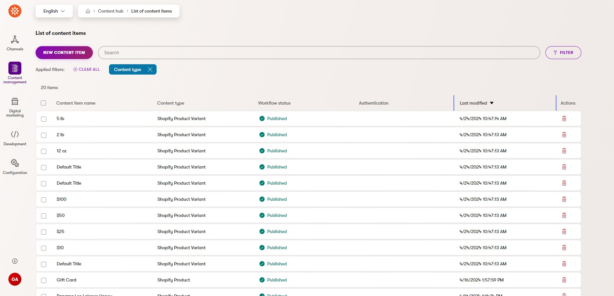
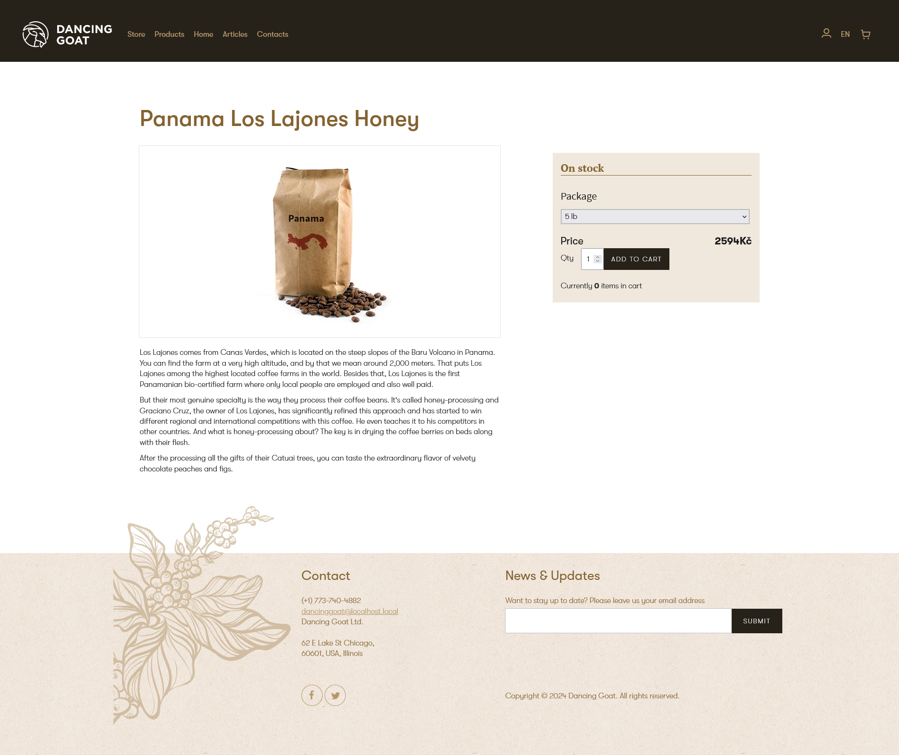
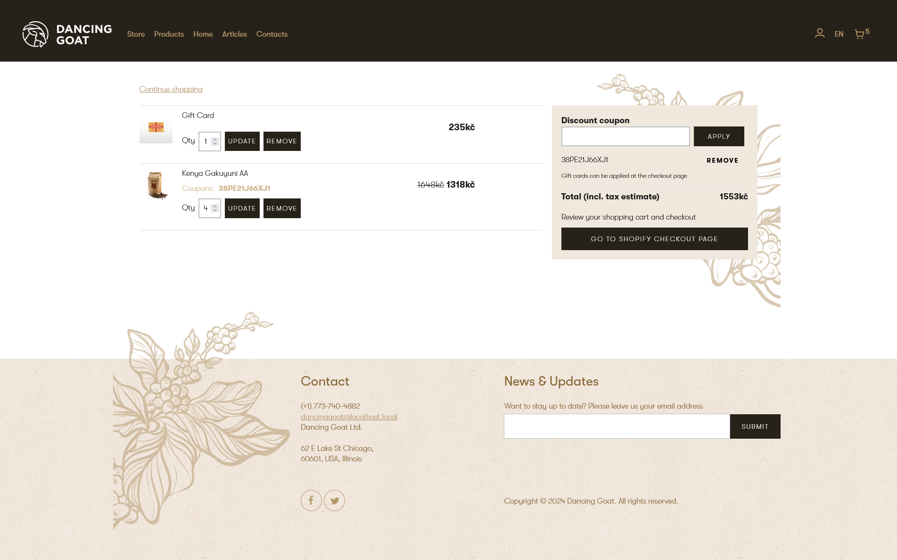
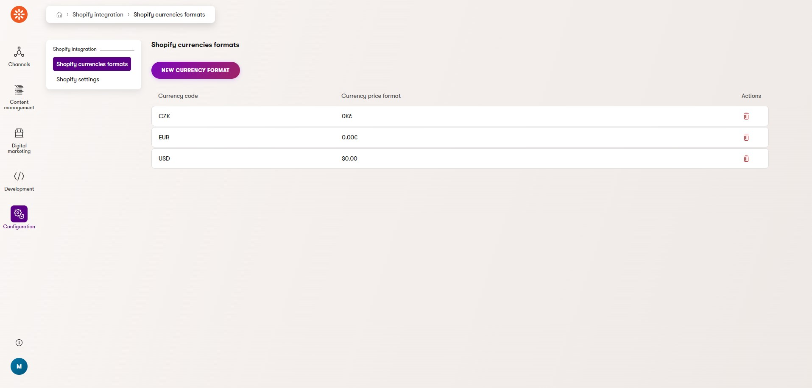

# Xperience by Kentico Shopify integration

[![7-day bug-fix policy](https://img.shields.io/badge/-7--days_bug--fixing_policy-grey?labelColor=orange&logo=data:image/svg+xml;base64,PHN2ZyBjbGFzcz0ic3ZnLWljb24iIHN0eWxlPSJ3aWR0aDogMWVtOyBoZWlnaHQ6IDFlbTt2ZXJ0aWNhbC1hbGlnbjogbWlkZGxlO2ZpbGw6IGN1cnJlbnRDb2xvcjtvdmVyZmxvdzogaGlkZGVuOyIgdmlld0JveD0iMCAwIDEwMjQgMTAyNCIgdmVyc2lvbj0iMS4xIiB4bWxucz0iaHR0cDovL3d3dy53My5vcmcvMjAwMC9zdmciPjxwYXRoIGQ9Ik04ODguNDkgMjIyLjY4NnYtMzEuNTRsLTY1LjY3Mi0wLjk1NWgtMC4yMDVhNDY1LjcxNSA0NjUuNzE1IDAgMCAxLTE0NC4zMTUtMzEuMzM0Yy03Ny4wMDUtMzEuMTk4LTEyNi4yOTQtNjYuNzY1LTEyNi43MDMtNjcuMTA3bC0zOS44LTI4LjY3Mi0zOS4xODUgMjguNDY4Yy0yLjA0OCAxLjUwMS00OS45MDMgMzYuMDQ0LTEyNi45MDggNjcuMzFhNDQ3LjQyIDQ0Ny40MiAwIDAgMS0xNDQuNTIgMzEuMzM1bC02NS44NzcgMC45NTZ2Mzc4Ljg4YzAgODcuMDQgNDkuODM0IDE4NC42NjEgMTM3LjAxIDI2Ny44MSAzNy41NDcgMzUuODQgNzkuMjU4IDY2LjM1NSAxMjAuODMzIDg4LjIgNDMuMjggMjIuNzMzIDg0LjI0IDM0LjYxMiAxMTguODUyIDM0LjYxMiAzNC40MDYgMCA3NS43NzYtMTIuMTUyIDExOS42MDMtMzUuMTU4YTU0Ny45NzcgNTQ3Ljk3NyAwIDAgMCAxMjAuMDEzLTg3LjY1NCA1MTUuMjA5IDUxNS4yMDkgMCAwIDAgOTYuMTg4LTEyMi44OGMyNy4xMDItNDkuNTYyIDQwLjgyMy05OC4zMDQgNDAuODIzLTE0NC45OTlsLTAuMTM2LTM0Ny4yMDR6TTUxMC4wOSAxNDMuNDI4bDEuNzA2LTEuMzY1IDEuNzc1IDEuMzY1YzUuODAzIDQuMTY1IDU5LjUyOSA0MS44NDggMTQwLjM1NiA3NC43NTIgNzkuMTkgMzIuMDg2IDE1My42IDM1LjYzNSAxNjcuNjYzIDM2LjA0NWwyLjU5NCAwLjA2OCAwLjIwNSAzMTUuNzM0YzAuMTM3IDY5LjQ5NS00Mi41OTggMTUwLjE4Ni0xMTcuMDc3IDIyMS40NTdDNjQxLjU3IDg1NC4yODkgNTYzLjEzIDg5Ni40NzggNTEyIDg5Ni40NzhjLTIzLjY4OSAwLTU1LjU3LTkuODk5LTg5LjcwMi0yNy43ODVhNDc4LjgyMiA0NzguODIyIDAgMCAxLTEwNS42MDktNzcuMjc4QzI0Mi4yMSA3MjAuMjEzIDE5OS40NzUgNjM5LjUyMiAxOTkuNDc1IDU2OS44OVYyNTQuMjI1bDIuNzMtMC4xMzZjMy4yNzggMCA4Mi42MDQtMS41MDIgMTY3LjY2NC0zNS45NzdhNzM5Ljk0MiA3MzkuOTQyIDAgMCAwIDE0MC4yMi03NC42MTV2LTAuMDY5eiIgIC8+PHBhdGggZD0iTTcxMy4zMTggMzY4LjY0YTMyLjIyMiAzMi4yMjIgMCAwIDAtNDUuMzI5IDBMNDQ5LjE5NSA1ODcuNDM1bC05My4xODQtOTMuMTE2YTMyLjIyMiAzMi4yMjIgMCAwIDAtNDUuMzMgMCAzMi4yMjIgMzIuMjIyIDAgMCAwIDAgNDUuMjZsMTE1Ljg1IDExNS44NWEzMi4yOSAzMi4yOSAwIDAgMCA0NS4zMjggMEw3MTMuMzIgNDEzLjlhMzIuMjIyIDMyLjIyMiAwIDAgMCAwLTQ1LjMzeiIgIC8+PC9zdmc+)](https://github.com/Kentico/.github/blob/main/SUPPORT.md#full-support) [](https://github.com/Kentico/xperience-by-kentico-shopify/actions/workflows/ci.yml)

| Name                          | Package                                                                                                                                            |
| ----------------------------- | -------------------------------------------------------------------------------------------------------------------------------------------------- |
| Kentico.Xperience.Shopify     | [](https://www.nuget.org/packages/Kentico.Xperience.Shopify)         |
| Kentico.Xperience.Shopify.Rcl | [](https://www.nuget.org/packages/Kentico.Xperience.Shopify.Rcl) |

## Description

This integration connects your Shopify store with the Xperience by Kentico application using [Shopify Storefront](https://shopify.dev/docs/api/storefront) and [Shopify Admin](https://shopify.dev/docs/api/admin) APIs. It provides synchronization of products and e-commerce actions between the two platforms. Implemented features provide users with the options to:

- Add, update and remove products in the shopping cart.
- Manage discount coupons.
- Proceed to checkout directly on the Shopify store page.

### Limitations

**Shopify API can return maximum of 250 items in one API request**. For larger number of products, pagination needs to be implemented. More info can be found in the [Usage-Guide.md](./docs/Usage-Guide.md#limitations).

## Screenshots


&nbsp;

&nbsp;


## Library Version Matrix

Summary of libraries (NuGet packages) used by this integration and their Xperience by Kentico version requirements. To use this integration, your Xperience project must be upgraded to at least the highest version listed.

| Library                            | Xperience by Kentico Version | Library Version |
| ---------------------------------- | ---------------------------- | --------------- |
| Kentico.Xperience.Ecommerce.Common | \>= 29.0.1                   | 1.0.0           |
| Kentico.Xperience.Shopify          | \>= 29.0.2                   | 1.0.0           |
| Kentico.Xperience.Shopify.Rcl      | \>= 29.0.2                   | 1.0.0           |

### Dependencies

- [ASP.NET Core 8.0](https://dotnet.microsoft.com/en-us/download)
- [Xperience by Kentico](https://docs.kentico.com/changelog)

## Quick Start

1. Generate Shopify API access tokens (see [Generating Shopify API credentials](./docs/Usage-Guide.md#generating-shopify-api-credentials) for details).

   - [Install](https://shopify.dev/docs/custom-storefronts/building-with-the-storefront-api/getting-started) the [Headless channel](https://shopify.dev/docs/custom-storefronts/getting-started/build-options#the-headless-channel) into your Shopify admin. During the installation, select **Create storefront** and [generate a private Storefront API token](https://shopify.dev/docs/api/usage/authentication#getting-started-with-private-access).
   - Install a [custom application](https://help.shopify.com/en/manual/apps/app-types/custom-apps#create-and-install-a-custom-app) into your Shopify admin and generate a Shopify Admin API access token. Set following access scopes: `write_product_listings`, `read_product_listings`, `write_products`, `read_products`, `read_inventory`, `write_orders`, `read_orders`.

2. Add these packages to your Xperience by Kentico application using the .NET CLI.

   ```powershell
   dotnet add package Kentico.Xperience.Shopify
   dotnet add package Kentico.Xperience.Shopify.Rcl
   ```

3. Configure your Xperience application to connect to your Shopify instance via the `CMSShopifyConfig` object. For development purposes, you can also configure these settings directly in the Xperience by Kentico administration via the **Shopify integration** application.

   ```json
   {
     "CMSShopifyConfig": {
       "ShopifyUrl": "https://your-shopify-store-url.com/",
       "AdminApiToken": "xxxxxxxxxxxxxxxxxxxxxxxxxxxxxxxxxx",
       "StorefrontApiToken": "xxxxxxxxxxxxxxxxxxxxxxxxxxxxxxxxxx",
       "StorefrontApiVersion": "YYYY-MM"
     }
   }
   ```

   **Setting description**
   | Setting | Description |
   | -------------------- | ------------------------------------------------------------------------------------- |
   | ShopifyUrl | URL of the Shopify store |
   | AdminApiToken | Access token for the Admin API calls |
   | StorefrontApiToken | Access token for the Storefront API calls |
   | StorefrontApiVersion | Storefront API version that will be used in API calls. Must use the format: `YYYY-MM` |

   Note: The `StorefrontApiVersion` refers to the version of the Shopify Storefront API you are using. You can find the available versions and their release dates in the [Shopify API versioning documentation](https://shopify.dev/docs/api/usage/versioning).

   You can also configure the integration via the [Shopify integration](#shopify-configuration-module) application in the Xperience admin UI. However, note that this approach should only be used for development purposes. For the production, use one of the recommended [configuration methods](https://learn.microsoft.com/en-us/dotnet/core/extensions/configuration).

4. Configure currency and country code for website channels via the `ShopifyWebsiteChannelsConfig` object.

   ```json
   {
     "ShopifyWebsiteChannelsConfig": {
       "Settings": [
         {
           "ChannelName": "MyWebsiteChannel1",
           "CurrencyCode": "CZK",
           "Country": "CZ"
         },
         {
           "ChannelName": "MyWebsiteChannel2",
           "CurrencyCode": "USD",
           "Country": "US"
         }
       ],
       "DefaultSetting": {
         "CurrencyCode": "CZK",
         "Country": "CZ"
       }
     }
   }
   ```

   **Setting description**
   | Setting | Description |
   |----------------|----------------------------------------------------------------------------------------------------------------|
   | Settings | List of configurations. Each item contains configuration for specific website channel defined by `ChannelName` |
   | DefaultSetting | Configuration used if no configuration found in the `Settings` for the given website channel. |

   Note: Only currencies set in the shopify store can be used.

5. Add services provided by the integration to the service container.

   ```csharp
   // Program.cs

   // Registers Shopify services
   builder.Services.RegisterShopifyServices(builder.Configuration);
   ```

6. Enable session state for the application.

   ```csharp
   // Program.cs

   // Enable session state for appliation
   app.UseSession();
   ```

7. Add Xperience objects used by the integration to your project using [Continuous Integration](https://docs.kentico.com/x/FAKQC). The integration's CI files are located under `.\examples\DancingGoat-Shopify\App_Data\CIRepository\`. This CI repository does not contain any other objects than objects related to Shopify integration so it can be merged into your existing CI repository. Copy these files to your Continuous Integration repository and run:

   ```powershell
   dotnet run --no-build --kxp-ci-restore
   ```
	The command restores the following objects:
		- Page content types: Thank you page, Shopping cart page, Shopify product detail page, Store page, Shopify category page(more info in [Usage-Guide.md](./docs/Usage-Guide.md#e-commerce-content-types).
		- Content types used for [synchronization with Shopify](./docs/Usage-Guide.md#shopify-products-synchronization): Shopify product, Shopify Product Variant, Shopify Image(more info in [Usage-Guide.md](./docs/Usage-Guide.md#e-commerce-content-types).
		- [Shopify integration module](#shopify-configuration-module) for setting API credentials and adding currency codes.
		- Custom activities: Product added to shopping cart, Product removed from shopping cart, Purchase, Purchased product.

   Using CD is not recommended for restoring `Product detail`, `Category`, `Store` pages and content items that were created by [synchronization with Shopify](./docs/Usage-Guide.md#shopify-products-synchronization). This is because the `Shopify product` content item is connected to Product detail page. Therefore, both Product detail page and Shopify product content item will be restored. However, the synchronization already created the same Shopify product content item, using CD restore will result in duplicate Shopify product content items. To filter these objects from continuous deployment, add following rule into `repository.config`:

   ```xml
    <!-- Insert this part into RepositoryConfiguration -->
   <ObjectFilters>
   	<ExcludedCodeNames>Shopify.Image;Shopify.StorePage;Shopify.Product;Shopify.ProductDetailPage;Shopify.ProductVariant;Shopify.CategoryPage</ExcludedCodeNames>
   </ObjectFilters>
   ```

8. The integration uses a **Products** [Page Builder](https://docs.kentico.com/x/6QWiCQ) widget to display products from your Shopify store. Since Page Builder widgets cannot be distributed as part of NuGet packages, you must copy the **Products** widget implementation from the example project in this repository to your project. The widget implementation is located in [this folder](./examples/DancingGoat-Shopify/Components/Widgets/Shopify/ProductListWidget).

9. Run your Xperience application (e.g., `using dotnet run`).

10. In the Xperience admin UI, open the [Shopify integration](#shopify-configuration-module) application and on the **Shopify currencies formats** tab and add the required currencies for your store. For currency codes, use the values from [CurrencyCodeEnum](https://shopify.dev/docs/api/storefront/2024-01/enums/CurrencyCode). To format the output, we recommend using [custom numeric format strings](https://learn.microsoft.com/en-us/dotnet/standard/base-types/custom-numeric-format-strings).

## Full Instructions

View the [Usage Guide](./docs/Usage-Guide.md) for more detailed instructions.

## Shopify configuration module

The integration adds a new **Shopify integration** application to the admin UI. Using the application, administrators can set Shopify API credentials and add currency formats. If Shopify API credentials are provided both via this application and configuration providers (e.g., appsettings.json), values from the configuration will take precedence. The application is located under the `Configuration` category.


## Codebase overview

Repository contains solution with Xperience by Kentico integration to Shopify. It shows the connection to the Shopify headless API and shows the implementation of a simple e-shop on Xperience by Kentico (extended Dancing Goat sample site). The solution consists of these parts:

- Kentico.Xperience.Shopify - class library that contains all services necessary for this integration.
- Kentico.Xperience.Shopify.Rcl - razor class library for selector components(used in standalone product listing widget).
- DancingGoat - Sample Dancing Goat site.
- [Kentico.Xperience.Ecommerce.Common](https://github.com/Kentico/xperience-by-kentico-ecommerce-common) - common library for e-commerce integrations.

## Contributing

To see the guidelines for Contributing to Kentico open source software, please see [Kentico's `CONTRIBUTING.md`](https://github.com/Kentico/.github/blob/main/CONTRIBUTING.md) for more information and follow the [Kentico's `CODE_OF_CONDUCT`](https://github.com/Kentico/.github/blob/main/CODE_OF_CONDUCT.md).

Instructions and technical details for contributing to **this** project can be found in [Contributing Setup](./docs/Contributing-Setup.md).

## License

Distributed under the MIT License. See [`LICENSE.md`](./LICENSE.md) for more information.

## Support

This project has **Full support by 7-day bug-fix policy**

See [`SUPPORT.md`](https://github.com/Kentico/.github/blob/main/SUPPORT.md#labs-limited-support) for more information.

For any security issues see [`SECURITY.md`](https://github.com/Kentico/.github/blob/main/SECURITY.md).
