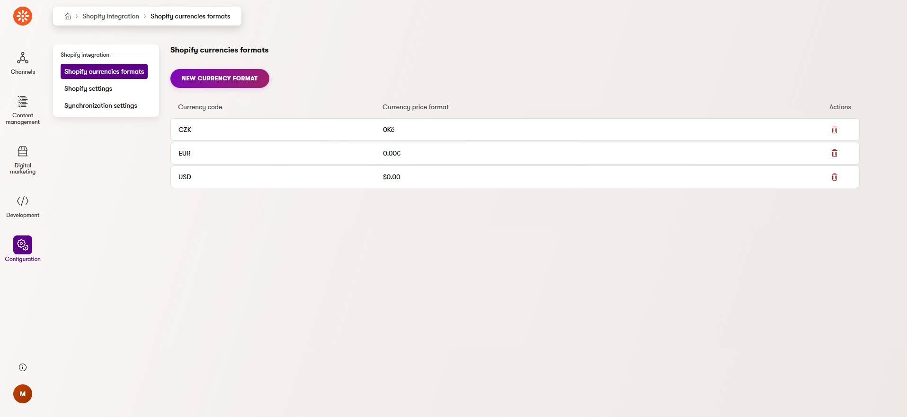

# Xperiene by Kentico Shopify integration

[](https://github.com/Kentico/.github/blob/main/SUPPORT.md#labs-limited-support) [](https://github.com/Kentico/xperience-by-kentico-shopify/actions/workflows/ci.yml)

## Description
This integration connects your Shopify store with the Xperience by Kentico application using Shopify Storefront and Admin APIs. It provides synchronization of products and e-commerce actions between the two platforms. Implemented features provide users with:
- Add, update and remove products in the shopping cart.
- Manage discount coupons.
- Proceed to checkout directly on the Shopify store page.

## Screenshots


## Library Version Matrix

Summary of libraries which are supported by the following versions Xperince by Kentico

| Library                            | Xperience by Kentico Version | Library Version |
|----------------------------------- |------------------------------| --------------- |
| Kentico.Xperience.Ecommerce.Common | \>= 29.0.1                   | 1.0.0           |
| Kentico.Xperience.Shopify          | \>= 29.0.2                   | 1.0.0           |
| Kentico.Xperience.Shopify.Rcl      | \>= 29.0.2                   | 1.0.0           |

### Dependencies
- [ASP.NET Core 8.0](https://dotnet.microsoft.com/en-us/download)
- [Xperience by Kentico](https://docs.kentico.com/changelog)

## Quick Start
1. Install Headless channel into the Shopify store and [create storefront](https://shopify.dev/docs/custom-storefronts/building-with-the-storefront-api/getting-started) and redeem private Storefront API token.
2. Create [custom application](https://help.shopify.com/en/manual/apps/app-types/custom-apps#create-and-install-a-custom-app) in the Shopify administration and redeem Admin API access token. Set following access scopes: `write_product_listings`, `read_product_listings`, `write_products`, `read_products`, `read_inventory`, `write_orders`, `read_orders`
3. Add these packages to your Xperience by Kentico application using the .NET CLI
```powershell
dotnet add package Kentico.Xperience.Shopify
dotnet add package Kentico.Xperience.Shopify.Rcl
```
4. Fill settings to connect your Shopify instance(this step can be skipped if the settings will be filled directly in the Xperience by Kentico administration)
```json
{  
  "CMSShopifyConfig": {
    "ShopifyUrl": "https://your-shopify-store-url.com/",
    "AdminApiToken": "xxxxxxxxxxxxxxxxxxxxxxxxxxxxxxxxxx",
    "StorefrontApiToken": "xxxxxxxxxxxxxxxxxxxxxxxxxxxxxxxxxx",
    "StorefrontApiVersion": "YYYY-MM"
  }
}
```
Note: The `StorefrontApiVersion` refers to the version of the Shopify Storefront API you are using. You can find the available versions and their release dates in the [Shopify API versioning documentation](https://shopify.dev/docs/api/usage/versioning).
If `CMSShopifyConfig` is not filled, it is possible to set it in the Xperience by Kentico administration. To use this method, go to Shopify configuration module in Xperience by Kentico admin page and fill the credentials. Note that this method should only be used for development purposes. It is recommended to fill in the credentials using User Secrets.
**Setting description**
| Setting              | Description                                                                      |
| -------------------- | -------------------------------------------------------------------------------- |
| ShopifyUrl           | URL of the Shopify store                                                         |
| AdminApiToken        | Access token for the Admin API calls                                             |
| StorefrontApiToken   | Access token for the Storefront API calls                                        |
| StorefrontApiVersion | Storefront API version that will be used in API calls. Must be in format YYYY-MM |
5. Add library to the application services
```csharp
// Program.cs

// Registers Shopify services
builder.Services.RegisterShopifyServices(builder.Configuration);
```
6. Enable session state for the application
```csharp
// Program.cs

// Enable session state for appliation
app.UseSession();
```
7. Restore CI repository files to database (reusable content types, custom activities). CI files are located in  `.\examples\DancingGoat-Shopify\App_Data\CIRepository\`  and copy these files to your application.
```powershell
dotnet run --no-build --kxp-ci-restore
```
This will restore following items:
- Page types: Thank you page, Shopping cart page, Shopify product detail page, Store page, Shopify category page.
- Content types: Shopify product, Shopify Product Variant, Shopify Image.
- Shopify integration module for setting API credentials and adding currency codes.
- Custom activities: Product added to shopping cart, Product removed from shopping cart, Purchase, Purchased product.
8.  Copy product listing widget from Dancing Goat example project to your project. Sample widget is located in  [here](https://github.com/Kentico/xperience-by-kentico-shopify/blob/feat/XbyK_Shopify_integration/examples/DancingGoat-Shopify/Components/Widgets/Shopify/ProductListWidget).
9. Start your livesite
10. Add currency formats in the [Shopify configuration module](#shopify-configuration-module). It is recommended to use [custom numberic format strings](https://learn.microsoft.com/en-us/dotnet/standard/base-types/custom-numeric-format-strings).
## Full Instructions

View the [Usage Guide](./docs/Usage-Guide.md) for more detailed instructions.

## Shopify configuration module
In this module, administrators can set Shopify API credentials and add currency formats. If Shopify API credentials are filled both in this module and JSON settings(appsettings.json/user secrets), values from JSON settings will be used. Module can be found under the `Configuration` category.


## Codebase overview
Repository contains solution with Xperience by Kentico integration to Shopify. It shows the connection to the Shopify headless API and shows the implementation of a simple e-shop on Xperience by Kentico (extended Dancing Goat sample site). The solution consists of these parts:
- Kentico.Xperience.Shopify - class library that contains all services necessary for this integration.
- Kentico.Xperience.Shopify.Rcl - razor class library for selector components(used in standalone product listing widget).
- DancingGoat - Sample Dancing Goat site.
- [Kentico.Xperience.Ecommerce.Common](https://github.com/Kentico/xperience-by-kentico-ecommerce-common) - common library for e-commerce integrations.

## Contributing

To see the guidelines for Contributing to Kentico open source software, please see [Kentico's `CONTRIBUTING.md`](https://github.com/Kentico/.github/blob/main/CONTRIBUTING.md) for more information and follow the [Kentico's `CODE_OF_CONDUCT`](https://github.com/Kentico/.github/blob/main/CODE_OF_CONDUCT.md).

Instructions and technical details for contributing to **this** project can be found in [Contributing Setup](./docs/Contributing-Setup.md).

## License

Distributed under the MIT License. See [`LICENSE.md`](./LICENSE.md) for more information.

## Support

This contribution has __Kentico Labs limited support__.

See [`SUPPORT.md`](https://github.com/Kentico/.github/blob/main/SUPPORT.md#labs-limited-support) for more information.

For any security issues see [`SECURITY.md`](https://github.com/Kentico/.github/blob/main/SECURITY.md).
